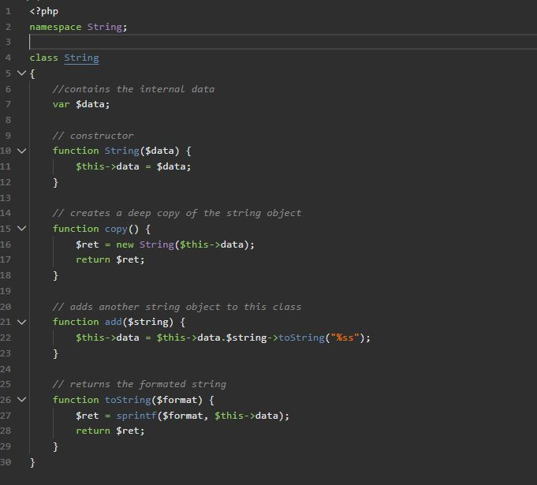

# BR Obsidian Dark for Visual Studio Code

## Preview



## Installation

### Cloning the Repository

Change to your VSCode extensions directory:

```bash
# Windows
$ cd %USERPROFILE%\.vscode\extensions

# Linux & macOS
$ cd ~/.vscode/extensions/
```

Clone repository:

```bash
$ git clone https://github.com/brstuff/br-obsidian-vscode-theme brobsidian
```

Select this theme from the Theme selector in VSCode

## License

MIT license
